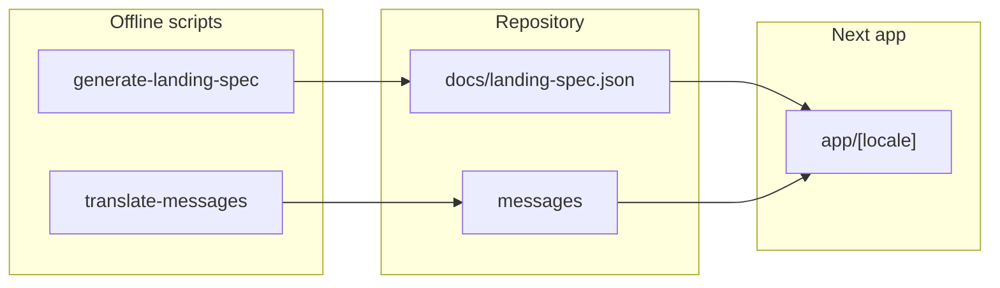

# Dordoi.help — архитектура

## Стек

- **Next.js 16** (App Router) + **TypeScript** + **Tailwind CSS v4** + **shadcn/ui** (Base UI primitives).
- **next-intl** — локали `ru`, `kk`, `kg`, `uz`, `tj`, префикс в URL всегда (`localePrefix: "always"`).
- **OpenAI SDK** — только в **offline-скриптах** (`scripts/`), не в API routes и не в runtime UI.

## 1. Как используется GPT‑5.5 Pro (только design)

- Скрипт: [`scripts/generate-landing-spec.mts`](../scripts/generate-landing-spec.mts).
- Модель: `OPENAI_DESIGN_MODEL` (по умолчанию `gpt-5.5-pro`), вызов **Responses API**.
- Результат: перезапись [`docs/landing-spec.json`](../docs/landing-spec.json).
- Контекст продукта для промпта: [`docs/design-from-ai.md`](design-from-ai.md).

### Почему GPT‑5.5 Pro только для design generation

- **Стоимость**: frontier/pro модель дороже массовых сценариев.
- **Переводы** не требуют «архитектурного» уровня рассуждения — для них используется **`OPENAI_TRANSLATION_MODEL=gpt-4o-mini`**.
- **Runtime AI не используется**: нет чата, нет `/api/*` для OpenAI — меньше поверхность атаки, предсказуемое поведение продукта.
- **Генерация лендинга — редкая операция** (при смене маркетинговой структуры), результат версионируется в `landing-spec.json`, а UI главной **строго** следует этому файлу (порядок секций, hero, CTA, токены spacing/typography).

## 2. Главная и `landing-spec.json`

- Спека парсится в [`lib/landing-spec.ts`](../lib/landing-spec.ts) (Zod).
- [`components/landing/HeroSection.tsx`](../components/landing/HeroSection.tsx) — порядок CTA из `spec.hero.ctaOrder`.
- [`components/landing/LandingSections.tsx`](../components/landing/LandingSections.tsx) — порядок блоков = `spec.sections` (id → компонент).
- Типографика и вертикальные отступы секций берутся из `spec.typography` / `spec.spacing` через хелперы `typographyClass` / `spacingClass`, сопоставленные с [`styles/tokens.css`](../styles/tokens.css).

## 3. Мультиязычность (i18n)

| Файл | Назначение |
|------|------------|
| [`i18n/routing.ts`](../i18n/routing.ts) | `defineRouting`, список локалей, `defaultLocale: ru` |
| [`i18n/navigation.ts`](../i18n/navigation.ts) | `createNavigation` → `Link`, `usePathname`, … |
| [`i18n/request.ts`](../i18n/request.ts) | `getRequestConfig`, merge RU + оверлей, `onError` в dev |
| [`middleware.ts`](../middleware.ts) | `next-intl/middleware` — редирект `/` → `/ru`, локаль в пути |

Подробности и команды: [`scripts/README-i18n.md`](../scripts/README-i18n.md).

## 4. SEO (мультиязычный)

| Механика | Где |
|----------|-----|
| **Canonical** на текущую локаль и путь | [`lib/seo.ts`](../lib/seo.ts) → `buildPageMetadata` → `alternates.canonical` |
| **hreflang / alternate** для всех локалей | `alternates.languages` + [`app/sitemap.ts`](../app/sitemap.ts) `alternates.languages` на каждой записи |
| **title / description** на языке страницы | `generateMetadata` на страницах через [`lib/build-seo.ts`](../lib/build-seo.ts) + ключи `Seo.*` в `messages` |
| **H1 / H2** на языке страницы | ключи `Pages.*.h1` / `h2` (и hero как `h1`/`h2` на главной) |
| **OpenGraph / Twitter** | `buildPageMetadata` |
| **Sitemap** | [`app/sitemap.ts`](../app/sitemap.ts) — все маршруты из [`lib/seo.ts`](../lib/seo.ts) `publicRoutes` × локали |
| **robots** | [`app/robots.ts`](../app/robots.ts) |
| Базовый URL | `NEXT_PUBLIC_APP_URL` (см. [`.env.example`](../.env.example)) |

## 5. Переводы (offline)

- Скрипт: [`scripts/translate-messages.mts`](../scripts/translate-messages.mts).
- Модель: `OPENAI_TRANSLATION_MODEL` (**gpt-4o-mini**, не gpt-5.5-mini).

## 6. Что намеренно отсутствует

- Supabase, auth, платежи, БД.
- `/api/ai-help` и любой runtime AI.
- Коммиты в git без явного разрешения владельца репозитория.

## Схема потоков

