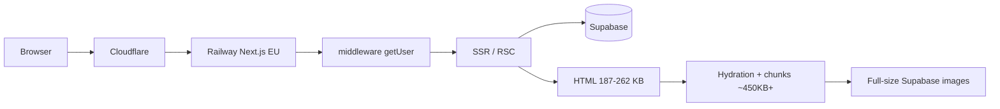
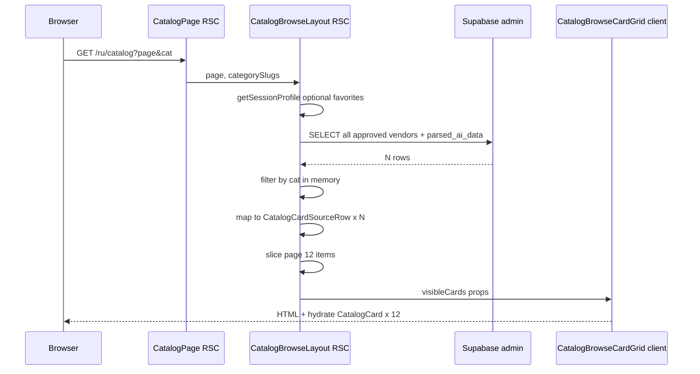

# Аудит скорости загрузки dordoi.help

**Дата:** 2026-05-13  
**Режим:** AUDIT ONLY (код/БД/деплой не менялись)  
**Окружение замеров:** Windows, curl.exe → production (Cloudflare → Railway `europe-west4`) + локальный `npm run build && npm run start` на `localhost:3000`

---

## Краткий вывод

Сайт ощущается «медленным как в 2000-м» не из‑за одной причины, а из‑за **наложения нескольких системных задержек**:

| Слой | Вклад в ощущение «тормозит» |
|------|----------------------------|
| **TTFB / SSR** | Главный фактор на `/ru/catalog` (**2.1–4.4 с** до первого байта HTML) |
| **Middleware Supabase `getUser()`** | Добавляет **~300–700 мс** на *каждый* HTML-запрос, даже для анонима |
| **Полная динамика HTML** | `Cache-Control: private, no-cache` → Cloudflare не кэширует страницы (`cf-cache-status: DYNAMIC`) |
| **Клиентский JS** | ~**450+ KB** только по ключевым чанкам + **16+ script tags** на `/ru`; гидрация layout на всех страницах |
| **Картинки каталога** | `` без `next/image` / без `sizes` → после HTML тянутся полные URL из Supabase Storage |
| **Analytics** | Лёгкий first-party трекер; **не** основной виновник TTFB |

**Самая проблемная страница:** `/ru/catalog` (и любая локаль `/catalog`).  
**Второе место:** `/ru` (лендинг) из‑за middleware + динамического SSR + тяжёлого client shell.  
**Быстрые страницы:** `/ru/suppliers`, `/ru/buyers`, `/sitemap.xml` (~0.3–0.6 с TTFB в prod).

**Важно:** маршрута `/ru/providers` **нет** (404). Профили поставщиков — `/ru/catalog/[slug]`.

---

## 1. Базовые замеры (production)

Замеры: `curl.exe -w` (TTFB = `time_starttransfer`, полный ответ).

### 1.1 TTFB по маршрутам (3 прогона, warm)

| Маршрут | TTFB run1 | TTFB run2 | TTFB run3 | HTML size | HTTP |
|---------|-----------|-----------|-----------|-----------|------|
| `/ru` | 1.02 s | 0.43 s | 0.44 s | ~187 KB | 200 |
| `/ru/catalog` | 2.53 s | 3.21 s | 2.61 s | ~262 KB | 200 |
| `/ru/suppliers` | 0.49 s | 0.48 s | 0.43 s | ~115 KB | 200 |
| `/ru/buyers` | 0.39 s | 0.44 s | 0.41 s | ~132 KB | 200 |
| `/sitemap.xml` | 0.38 s | 0.43 s | 0.32 s | ~45 KB | 200 |
| `/` | — | — | — | redirect | **307 → /ru** |
| `/ru/providers` | — | — | — | — | **404** |

Дополнительно:

| Маршрут | TTFB (1 run) | Примечание |
|---------|--------------|------------|
| `/ru/catalog/container-04-12` | 1.14 s | статический showcase slug (без тяжёлого DB-профиля) |
| `/ru/catalog/tkani-dordoi` | 0.39 s | showcase slug, warm |

Первый запрос `/ru` после паузы: **TTFB ~1.69 s**, total ~2.0 s (холоднее контейнер + middleware + SSR).

### 1.2 Заголовки ответа (production)

**`/ru` и большинство страниц:**

```
Cache-Control: private, no-cache, no-store, max-age=0, must-revalidate
vary: rsc, next-router-state-tree, next-router-prefetch, ...
cf-cache-status: DYNAMIC
x-railway-edge: railway/europe-west4-drams3a
```

**`/ru` (и layout):** preload **4× woff2** (Inter + Geist Mono subsets).

**`/ru/catalog`:** дополнительно preload **2 CSS chunks**.

**`/sitemap.xml`:** `Cache-Control: public, max-age=0, must-revalidate` — формально public, но `max-age=0` и `DYNAMIC` у CF.

**`/`:** `307` → `https://dordoi.help/ru`, `Set-Cookie: NEXT_LOCALE=ru` — лишний round-trip при заходе на корень.

---

## 2. Локальные замеры (отделение Railway от логики приложения)

`npm run build` (Next 16.2.6, Turbopack) + `npm run start` на `127.0.0.1:3000`.

| Маршрут | TTFB run1 | TTFB run2 | TTFB run3 |
|---------|-----------|-----------|-----------|
| `/ru` | 0.29 s | **0.026 s** | **0.020 s** |
| `/ru/catalog` | **2.77 s** | **2.44 s** | **2.13 s** |
| `/ru/suppliers` | **0.016 s** | **0.015 s** | **0.015 s** |

### Интерпретация

- **`/ru/catalog` медленный и без Railway** (2.1–2.8 s локально) → узкое место в **коде + Supabase**, не cold start.
- **`/ru` warm локально ~20 ms**, в prod ~430 ms → **~400 ms overhead**: сеть KZ↔EU + Cloudflare + **middleware `getUser()`** + отсутствие edge cache.
- **Railway cold start** влияет на первый запрос после простоя (run1 `/ru` prod 1.0 s vs warm 0.43 s), но **не объясняет** стабильные 2+ s на каталоге.

---

## 3. Что именно тормозит (по категориям)

### 3.1 Server response / TTFB

**Высокий приоритет.**

1. **`/catalog` — `force-dynamic` + полный SELECT всех approved vendors**  
   - `app/[locale]/catalog/page.tsx` — `export const dynamic = "force-dynamic"`.  
   - `CatalogBrowseLayout` → `fetchPublishedVendorsForCatalog()` тянет **все** строки `vendors` со статусом `approved`, включая **`parsed_ai_data` JSONB**, затем фильтрует и пагинирует **в памяти** (page size 12).  
   - Файл: `lib/catalog/published-vendors.ts` (select + `.order("created_at")`, без `limit`).

2. **Дублирующие auth-запросы на каталоге**  
   - Middleware: `await supabase.auth.getUser()` на каждый HTML hit (`utils/supabase/middleware.ts`).  
   - `CatalogBrowseLayout`: `getSessionProfile()` → ещё один `getUser()` + опционально `profiles` + vendor row (`lib/auth/session-profile.ts`).  
   - Для анонимного пользователя **оба вызова — чистый overhead**.

3. **Корневой layout делает все страницы динамическими**  
   - `app/layout.tsx`: `await headers()` для `lang` → в build **все** маршруты помечены `ƒ` (dynamic), нет статического HTML в CDN.

4. **i18n messages на каждый запрос**  
   - `i18n/request.ts`: dynamic `import` `messages/ru.json` (~89 KB) + merge для других локалей (до ~90 KB overlay).  
   - `app/[locale]/layout.tsx`: `getMessages()` → `NextIntlClientProvider` сериализует messages в RSC payload для **всех** публичных страниц.

### 3.2 Next.js SSR / RSC

- HTML `/ru`: **~187 KB**, `/ru/catalog`: **~262 KB** (много inline RSC stream: `__next_f.push`, 21+ chunk в потоке).
- В HTML **16 уникальных JS chunks** + turbopack runtime; на практике браузер тянет **больше** зависимостей по цепочке импортов.
- Каталог: server рендерит 12 карточек, но передаёт в client `CatalogBrowseCardGrid` props с полными данными карточек (описания, photo URLs, commerce copy).

### 3.3 Middleware / i18n redirects

- `middleware.ts`: `next-intl` + `updateSession` на matcher почти всех путей.  
- `/` → **307** на `/ru` (дополнительный RTT).  
- Production-only правка `x-forwarded-port` (Railway) — корректна, не выглядит как источник секунд задержки.

**Ограничение аудита:** менять middleware без отдельного approve — в плане только как рекомендация с оценкой риска.

### 3.4 Лишний JS bundle

Production build — крупнейшие артефакты:

| Chunk (примерно) | Размер |
|------------------|--------|
| `0a1fuw9bg8yaq.js` | 222 KB |
| `0eg-w~zpye7j~.js` | 233 KB |
| `09.wi-fjaf7-~.js` | 134 KB |
| CSS `15sxzocts2fey.css` | 172 KB |

Выборочно «ядро» страницы: **~446 KB** (5 chunks) **до gzip**.

**Client islands на каждой публичной странице** (`app/[locale]/layout.tsx`):

- `SiteHeader` — Supabase client `getSession()` + `onAuthStateChange`, Sheet, locale switcher  
- `DordoiAnalyticsTracker`  
- `AuthDialogProvider` / `AuthDialog`  
- `NuqsAdapter` в root layout — глобально для URL state (`?page=`, `?cat=`)

**Только на `/catalog`:**

- `CatalogBrowseCardGrid` + `CatalogCard` + `CatalogCardPhotoRail` (client)  
- `CatalogCategoryFilter` — **framer-motion** (`AnimatePresence`, `motion`)  
- `CatalogFavoriteButton` — client Supabase для избранного

`framer-motion` подключён **только** в `CatalogCategoryFilter.tsx` — умеренный, но избегаемый вес на самой тяжёлой странице.

### 3.5 Картинки / шрифты

**Шрифты:** `next/font` Inter (latin + cyrillic + cyrillic-ext) + Geist Mono; **4 preload woff2** в `<head>` на каждой странице. `display: swap` на Inter — хорошо; 4 preload — конкуренция за bandwidth с CSS/JS на первом экране.

**Картинки каталога:** намеренно **plain ``** (не `next/image`):

- `CatalogCard.tsx` — logo, `loading="lazy"`  
- `CatalogCardPhotoRail.tsx` — carousel, первое фото `loading="eager"`  
- `DatabaseProviderProfileView.tsx` — `MediaImage` с ``

Причина в коде: обход `remotePatterns` / внешних URL. Следствие: **нет ресайза, нет WebP/AVIF, нет `sizes`** → после быстрого (или медленного) HTML браузер качает полноразмерные объекты из Supabase Storage; на каталоге это доминирует **визуальное** «догружается вечно».

### 3.6 Blocking CSS/JS

- 2 CSS файла в head с `data-precedence="next"`.  
- Множество `<script async>` в head — не классический blocking, но **большой объём парсинга/компиляции** до интерактивности.  
- RSC streaming: часть контента откладывается (`$RC`, Suspense boundaries на category filter).

### 3.7 Supabase / API

| Где | Что | Когда |
|-----|-----|-------|
| Middleware | `auth.getUser()` | Каждый HTML |
| `/catalog` layout | Admin client: all approved vendors + `parsed_ai_data` | Каждый запрос |
| `/catalog` layout | `getSessionProfile` + favorites | Каждый запрос (favorites только если залогинен) |
| `/catalog/[slug]` | `fetchPublishedVendorBySlug` в **metadata и page** | Дубль на DB slug |
| `/catalog/[slug]` | `fetchApprovedVendorPhotoBatches` | Профиль DB vendor |
| Client | `SiteHeader.getSession`, favorites, analytics POST | После hydration |

Admin Supabase client на публичном каталоге — осознанный обход RLS, но цена — полный скан таблицы на каждый view.

### 3.8 Analytics / Telegram / event tracking

- **Нет GA/GTM** в коде.  
- `DordoiAnalyticsTracker`: `first_visit` → `POST /api/dordoi/analytics/event`, document click delegation — **после load**, не блокирует TTFB.  
- Telegram в analytics route — server-side уведомления админу, не pixel.

### 3.9 Railway cold start / runtime

- Edge: `europe-west4` (из заголовков).  
- Warm TTFB для лёгких страниц ~0.4 s; cold spike ~1 s на `/ru`.  
- **Не главный фактор** для каталога (локально те же 2+ s).

### 3.10 Hydration / client components

- Все `app/**/page.tsx` — Server Components; гидрация идёт через layout client boundary.  
- Каталог: **12 × `CatalogCard`** client components в сетке — заметная работа main thread после загрузки JS.  
- `useIsCatalogMobile` в каждой карточке — лишние listeners если не мемоизирован на grid level.

### 3.11 Layout shift / late rendering

- Шрифты: swap — возможен FOUT.  
- Фото каталога lazy — CLS при подгрузке превью.  
- Category filter в `Suspense` — возможен layout shift при появлении фильтра.  
- Sticky header с `backdrop-blur` — обычно стабилен.

---

## 4. Рейтинг страниц (от худшей к лучшей)

| # | Страница | Prod TTFB (типично) | Главная причина |
|---|----------|---------------------|-----------------|
| 1 | `/ru/catalog` | **2.5–4.4 s** | Full vendor fetch + `parsed_ai_data` + auth overhead |
| 2 | `/ru` | **0.43–1.0 s** | Dynamic SSR + middleware auth + fat client shell + 187 KB HTML |
| 3 | `/ru/catalog/[db-slug]` | **0.4–1.5 s+** | DB vendor + photo batches + duplicate metadata fetch |
| 4 | `/ru/suppliers`, `/ru/buyers` | **~0.4–0.5 s** | Нет Supabase на SSR; остаётся middleware + dynamic layout |
| 5 | `/sitemap.xml` | **~0.32–0.43 s** | Лёгкий XML, но всё ещё dynamic generation |
| — | `/ru/providers` | N/A | **404** — маршрут не существует |
| — | `/` | +1 RTT | 307 redirect |

---

## 5. План ускорения (безопасные изменения, по приоритету)

Оценка: **Impact / Risk / Effort**.  
Пункты с middleware помечены — нужен **отдельный approve**.

### P0 — максимальный эффект, умеренный риск

| # | Действие | Эффект | Риск | Файлы / зона |
|---|----------|--------|------|--------------|
| 1 | **Пагинация и SELECT на уровне БД** для каталога: `limit/offset` или keyset, **не тащить `parsed_ai_data` в list query** (только поля карточки; overlay — отдельно или materialized columns) | −1.5…3 s TTFB на `/catalog` | Низкий при сохранении той же сортировки | `published-vendors.ts`, `CatalogBrowseLayout.tsx` |
| 2 | **Убрать `getSessionProfile` с критического пути каталога для анонимов** — favorites подгружать client-side или только при наличии session cookie | −100…400 ms + меньше Supabase load | Низкий | `CatalogBrowseLayout.tsx` |
| 3 | **Кэширование списка vendors**: `unstable_cache` / `revalidate` 60–300 s вместо `force-dynamic` | −80% повторных DB hits | Средний: задержка обновления карточки | `catalog/page.tsx`, fetch layer |
| 4 | **Не вызывать `getUser()` в middleware для путей без auth** (публичные страницы) — только `/cabinet`, `/api/auth`, POST с cookies | −300…700 ms TTFB **на всех страницах** | **Средний** — нужен approve; сессия может устареть до захода в cabinet | `middleware.ts` ⚠️ |

### P1 — хороший эффект, низкий риск

| # | Действие | Эффект | Риск |
|---|----------|--------|------|
| 5 | **Статика / ISR для лендинга и article pages** (`/ru`, `/suppliers`, …): убрать зависимость от `headers()` или заменить на middleware-injected header без opt-out из static | Большой выигрыш на `/ru`, CDN cache | Низкий |
| 6 | **Сузить `NextIntlClientProvider` messages** — только namespaces для header/footer/auth, не весь `ru.json` (~89 KB) | Меньше HTML/RSC, быстрее hydration | Низкий |
| 7 | **`next/image` для Supabase URLs** (patterns уже в `next.config.ts`) с фиксированными `sizes` на карточках | Быстрее LCP, меньше трафика | Низкий |
| 8 | **Дедуп `fetchPublishedVendorBySlug`** между `generateMetadata` и page (React `cache()`) | −1 DB round-trip на profile | Низкий |
| 9 | **Lazy-load `AuthDialog`** / отложить `SiteHeader` session до idle | Меньше JS на first paint | Низкий |

### P2 — инфраструктура и полировка

| # | Действие | Эффект | Риск |
|---|----------|--------|------|
| 10 | **Cloudflare cache rules** для публичного HTML (если появится `s-maxage` / ISR) | −RTT globally | Низкий при правильных `Vary` |
| 11 | **Railway min instances / keep-warm** | Убрать cold 1 s spikes | $ |
| 12 | Заменить **framer-motion** в фильтре на CSS transitions | −~50–100 KB JS на catalog | Низкий |
| 13 | Сократить **font preload** (1–2 веса Inter вместо 4 файлов) | Меньше конкуренции в head | Низкий |
| 14 | **Internal rewrite `/` → `/ru`** вместо 307 (или preload redirect) | −1 RTT | Низкий |

### Не трогать в рамках этого аудита (по ТЗ)

- auth/payments/Lemon flows  
- Telegram notification logic  
- middleware без approve  
- legacy ScholarshipTop  
- SEO-изменения (sitemap scope и т.д.) — отдельный трек

---

## 6. Диагностика «как проверить после фиксов»

```bash
# TTFB production
curl.exe -w "ttfb=%{time_starttransfer}s total=%{time_total}s size=%{size_download}\n" -o NUL -s https://dordoi.help/ru/catalog

# Локально без Railway
npm run build && npm run start
curl.exe -w "ttfb=%{time_starttransfer}s\n" -o NUL -s http://127.0.0.1:3000/ru/catalog

# Заголовки кэша
curl.exe -I https://dordoi.help/ru
```

Рекомендуемые метрики: **TTFB**, **LCP**, **Total Blocking Time**, **transfer size** на `/ru` и `/ru/catalog` (Lighthouse mobile, 4G throttling).

---

## 7. Сводная диаграмма (узкие места)



---

## 8. Артефакты аудита

- Production + local curl замеры (см. разделы 1–2)  
- `npm run build` — все маршруты `ƒ` dynamic  
- Код: `middleware.ts`, `utils/supabase/middleware.ts`, `app/layout.tsx`, `app/[locale]/layout.tsx`, `app/[locale]/catalog/page.tsx`, `lib/catalog/published-vendors.ts`, `components/catalog/*`

**Следующий логичный шаг (вне AUDIT):** реализовать P0.1 + P0.3 для `/catalog`, затем согласовать P0.4 (middleware auth scope).

---

## P0 implementation — Stage P0.1 (data flow, до правок)

Разбор текущего pipeline `/ru/catalog` по коду (2026-05-13, без изменений).

### Catalog data flow before fix

- **Route:** `app/[locale]/catalog/page.tsx` — URL `/ru/catalog` через `next-intl` (`localePrefix: "always"`). Query: `?page=`, `?cat=`, `?compare=1` (debug). `export const dynamic = "force-dynamic"` (стр. 8–9).

- **Server component:** `CatalogPage` (async RSC) → **`CatalogBrowseLayout`** (`components/catalog/CatalogBrowseLayout.tsx`, async RSC). Метаданные: `generateMetadata` → `buildSeoMetadata(locale, "/catalog", …)`.

- **Client component:** список рендерит **`CatalogBrowseCardGrid`** (`"use client"`) → **`CatalogCard`** + опционально **`CatalogFavoriteButton`**. Фильтр категорий — **`CatalogCategoryFilter`** (client, `Suspense` в layout); пишет `?cat=` через **nuqs** (`catalogQueryParsers` в `lib/catalog/catalog-query-parsers.ts`). Поисковый `<input>` в layout **не подключён** к фильтрации (только UI).

- **Supabase query:** **`fetchPublishedVendorsForCatalog()`** в `lib/catalog/published-vendors.ts` (стр. 103–110). Клиент: **`createAdminClient()`** (service role, обход RLS). Таблица: `vendors`. Условия: `status = 'approved'`, `slug IS NOT NULL`, `order("created_at", { ascending: false })`. **Без `limit` / `range`** — все строки. SELECT: константа `PUBLISHED_VENDOR_SELECT_FIELDS` (стр. 92–93). После fetch — JS-фильтр скрытых slug / blocked store names (стр. 121–178).

- **Pagination location:** **в памяти** в `CatalogBrowseLayout`: `CATALOG_PAGE_SIZE = 12` (стр. 26), `totalPages = ceil(cardCount / 12)` (стр. 179), `visibleCards = cards.slice(pageStart, pageEnd)` (стр. 181–183). Номер страницы из `?page=` парсится в `CatalogPage` через `nuqs/server` `createLoader(catalogQueryParsers)`. UI пагинации — server-rendered `<Link href={buildCatalogBrowsePath(...)}>` (стр. 249–324).

- **Filters location:** URL `?cat=` → `normalizeCatalogCategorySlugs` в `CatalogPage` → **`filterPublishedVendorsBySubcategorySlugs`** (`lib/catalog/catalog-category-filter.ts`, стр. 41–53) — **после полного fetch**, in-memory: сопоставление `vendor.categories` (нормализованные main id) с выбранными main из slug-ов. Клиентский `CatalogCategoryFilter` только меняет URL; повторный SSR снова тянет всех vendors.

- **Heavy fields:** в list SELECT явно включён **`parsed_ai_data`** (JSONB). Также на каждую строку: **`product_photos`** (массив URL), плюс текстовые поля анкеты. `parsed_ai_data` разбирается в **`getAiCatalogDisplayOverlay`** (`lib/catalog/parsed-ai-catalog-overlay.ts`) внутри **`vendorToCatalogCardSource`** — overlay может быть крупнее, чем нужно для превью карточки.

- **Fields needed for list card:** итоговая форма — **`CatalogCardSourceRow`** / **`ParsedVendorCardData`** (`lib/catalog/vendor-card-display.ts`). Минимум из БД для одной карточки списка:
  - **Идентификация / ссылка:** `id`, `slug`
  - **Заголовок:** `store_name` + из overlay `catalogBrandName`; `instagram_url` (участвует в `resolveCatalogStoreTitleForCard`)
  - **Текст:** `description` (fallback) или overlay `description`, `subtitle`
  - **Тип сделки:** overlay `tradeType` или эвристика из **`min_batch`** (`inferVendorTradeType`)
  - **Commerce (fallback без ИИ):** `payment_methods`, `samples_available`, `samples_note`, `returns_policy` (`commerceCopyFromVendorRow`)
  - **Медиа:** `logo_url`, **`product_photos`** → `photoUrls`
  - **Категории:** `categories` (фильтр `?cat=` + локализованные лейблы в `buildCatalogCardSourceRowForPublishedVendor`)
  - **Даты (i18n строки):** `created_at` → `addedLine` / `updatedLine`
  - **ИИ-overlay (если есть):** из **`parsed_ai_data`**: `display.description`, `catalogBrandName`, `subtitle`, `tradeType`, `commerce.*` — см. `getAiCatalogDisplayOverlay`
  - **Не из БД на list path:** showcase slug-и подменяют title/description из i18n (`getShowcaseCatalogFields`)

### Дополнительная работа на critical path (не list query, но блокирует TTFB)

| Шаг | Где | Что |
|-----|-----|-----|
| Auth profile | `CatalogBrowseLayout` стр. 123–126 | `getSessionProfile()` → Supabase `getUser` + `profiles` |
| Favorites | стр. 124–126 | `fetchBuyerFavoriteKeySet` только если есть profile |
| i18n | стр. 120–122 | `getTranslations` ×2 namespaces |
| Dynamic flag | `catalog/page.tsx` | `force-dynamic` — без ISR / `unstable_cache` |

### Схема потока (as-is)



### Вывод для следующего этапа (P0.2+)

Узкое место — связка **`fetchPublishedVendorsForCatalog` (full scan + `parsed_ai_data`) → in-memory filter → in-memory pagination → map all rows**. Целевое состояние: **DB-level filter + count + `range(offset, limit)`**, list SELECT **без полного JSONB** (overlay — узкий extract или denormalized columns позже), **кэш/revalidate** вместо `force-dynamic` где безопасно.
